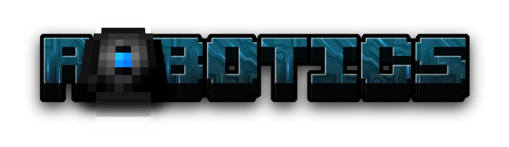

Robotics is a Forge mod for Minecraft 1.20.1

### License

### Credits
- <a href="https://www.textstudio.com/">Title font generated with textstudio</a>
- <a href="https://de.freepik.com/vektoren-kostenlos/3d-stil-schwarzer-hintergrund-mit-papierschicht_36325403.htm#fromView=search&page=1&position=16&uuid=431323a0-2833-4efb-b4e8-16da59daff7d">Title letter background image by almumtazza on Freepik</a>
- Some textures are recolors of other people's work:
  - Arms & Legs by Robotics Parts
  - The robot texture was a minecraft skin uploaded to minecraftskins.com. Despite vehement searching I cannot find it again anywhere on the internet. Reach out if you have any pointers!